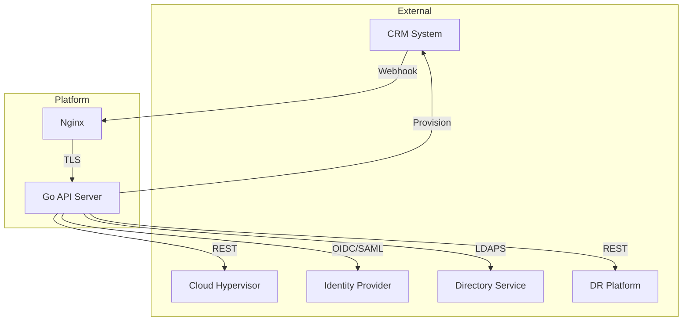
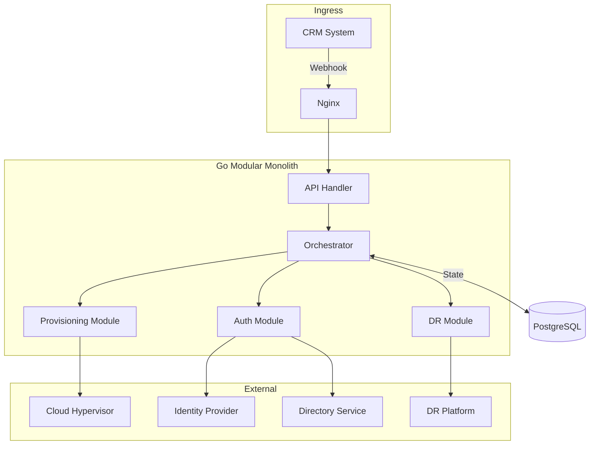
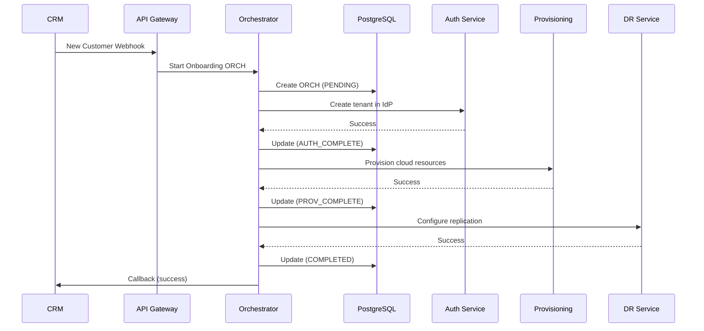
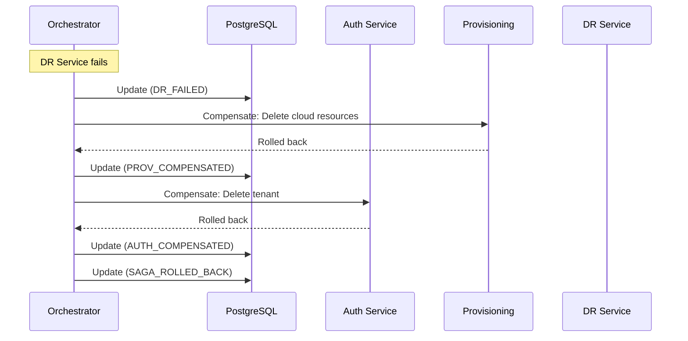

# Multi-Tenant Cloud Platform

## Overview

Backend automation platform enabling enterprise customers to provision cloud
infrastructure, SSO/MFA, SCIM user provisioning, and disaster recovery through a
unified system.

**Key outcomes:**

- Reduced customer onboarding from hours of manual work to under 20 seconds
- Maintained high-availability SLA across all integrations 99.999% so far
- Zero data loss during external service outages

---

## My Role

Solely architected and engineered a multi-tenant Go backend automation system
serving 50+ enterprise clients at 99.999% uptime. Evaluated and selected Go over
TypeScript, Python, and Rust for its concurrency model (goroutines), standard
library depth, and development velocity. Integrates VMware Cloud Director,
Keycloak, Zerto, Active Directory, and CRM billing APIs into a unified
orchestration workflow

- End-to-end system architecture
- SSO/MFA integration (Keycloak, SAML, OIDC, LDAP)
- Automated provisioning pipelines
- CI/CD infrastructure
- v2 orchestration migration (in progress)

---

## System Architecture

### v1 — Synchronous Monolith (Current Production)

The initial system prioritized minimal dependencies (only 1 is LDAP) and
speed-to-market. v1 uses synchronous request handlers in a Go modular monolith.
v2 adds River Queue orchestration with PostgreSQL-backed state management for
improved resilience and failure handling.



**Characteristics:**

- Single Go binary on systemd
- Synchronous request handling
- Minimal dependencies (intentional)
- All orchestration in request handlers

**Tradeoffs:**

| Pros              | Cons                                |
| ----------------- | ----------------------------------- |
| Simple deployment | Timeout risks on long operations    |
| Easy debugging    | No retry isolation                  |
| Fast iteration    | Tight coupling to external services |

---

### v2 — Orchestration Pattern with River & PostgreSQL (In Development)

Adding orchestration to the monolith for resilience and durability. Same
deployment model, better failure handling.



**Why stay monolith?**

- Small team (solo engineer + maybe 2 juniors onboarding)
- ~100 operations/day doesn't justify distributed complexity
- Orchestration pattern solves the actual problem: coordinating unreliable
  external services
- Can extract modular services later if scale demands it

---

## Orchestrator: Customer Onboarding Flow



---

## Orchestrator: Compensation (Rollback) Flow

When a step fails, the ORCH reverses previously completed steps in order.



---

## Orchestrator State Machine


---

## PostgreSQL Orchestrator Table Design

```sql
-- ORCH instance tracking
CREATE TABLE ORCHS (
    id UUID PRIMARY KEY DEFAULT gen_random_uuid(),
    type VARCHAR(50) NOT NULL,           -- 'customer_onboarding', etc.
    state VARCHAR(50) NOT NULL,          -- Current state
    payload JSONB NOT NULL,              -- Input data
    context JSONB DEFAULT '{}',          -- Accumulated results
    created_at TIMESTAMPTZ DEFAULT NOW(),
    updated_at TIMESTAMPTZ DEFAULT NOW(),
    completed_at TIMESTAMPTZ,
    error TEXT
);

-- ORCH step history (audit log)
CREATE TABLE ORCH_steps (
    id UUID PRIMARY KEY DEFAULT gen_random_uuid(),
    ORCH_id UUID REFERENCES ORCHS(id),
    step VARCHAR(50) NOT NULL,
    status VARCHAR(20) NOT NULL,         -- 'started', 'completed', 'failed', 'compensated'
    input JSONB,
    output JSONB,
    error TEXT,
    started_at TIMESTAMPTZ DEFAULT NOW(),
    completed_at TIMESTAMPTZ
);

CREATE INDEX idx_ORCHS_state ON ORCHS(state);
CREATE INDEX idx_ORCH_steps_ORCH_id ON ORCH_steps(ORCH_id);
```

---

## Why Orchestrator Pattern?

| Requirement              | Why Orchestrator Solves It                        |
| ------------------------ | ------------------------------------------------- |
| Long-running operations  | Each step is independent, no HTTP timeout risk    |
| Partial failure handling | Compensating transactions rollback cleanly        |
| Auditability             | Every state transition persisted in PostgreSQL    |
| Resumability             | ORCH can resume after crash from last known state |
| Observability            | Clear state machine makes debugging trivial       |

---

## Why Roll Your Own Orchestrator?

Evaluated several approaches for workflow orchestration:

| Option              | Verdict                                                                                   |
| ------------------- | ----------------------------------------------------------------------------------------- |
| **Temporal**        | Excellent, but heavy. Requires separate cluster, adds operational burden for ~100 ops/day |
| **NATS JetStream**  | Overkill for current throughput                                                           |
| **RabbitMQ**        | Same — adds infra without proportional benefit                                            |
| **PostgreSQL + Go** | Right-sized. ACID transactions, simple queries, already in stack                          |

**Decision:** Riverqueue orchestrator with PostgreSQL state. Polls for pending
work. If we hit scale limits, a message broker is in the upgrade path — but
that's a good problem to have.

---

## Key Technical Decisions

See [decisions.md](./decisions.md) for detailed writeups on:

- Identity provider evaluation
- Monolith-first strategy
- LDAPS over LDAP
- Idempotency patterns
- Why Go

---

## Code Samples

See [code-samples.md](./code-samples.md) for anonymized production patterns:

- Graceful shutdown
- Retry with exponential backoff
- Functional options pattern
- Middleware (recovery, logging, auth)
- Error handling
- Webhook signature validation
- Input validation with generics
