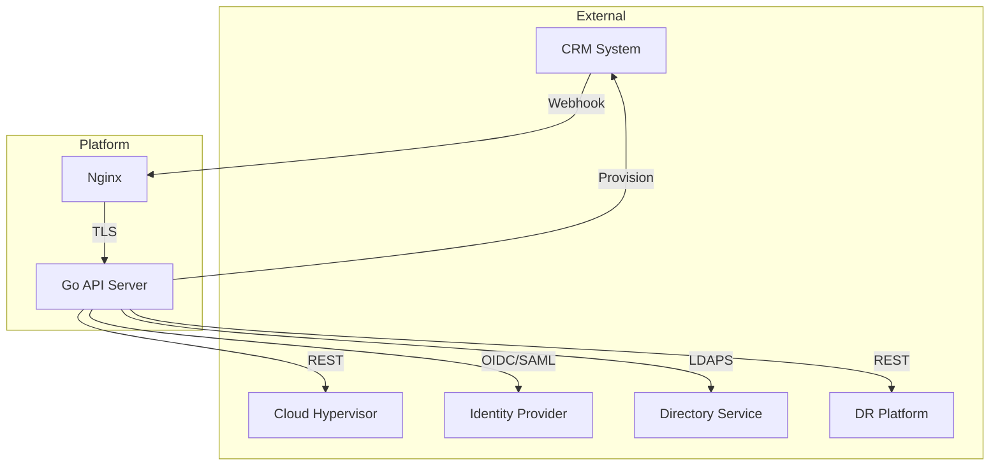
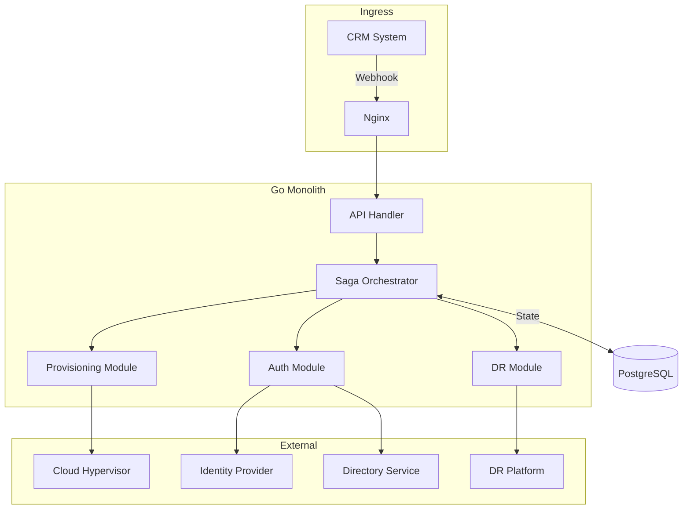
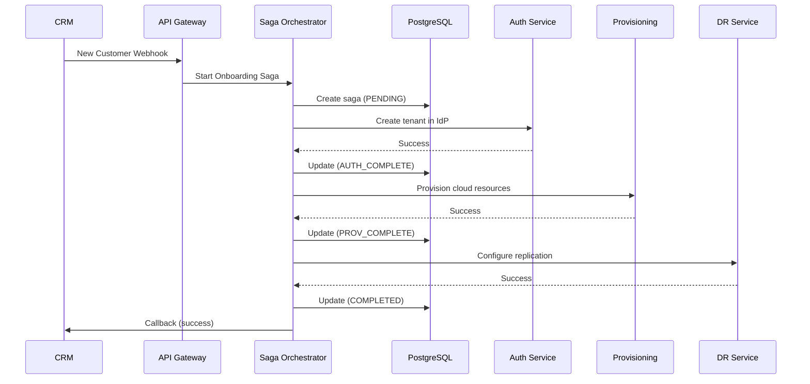
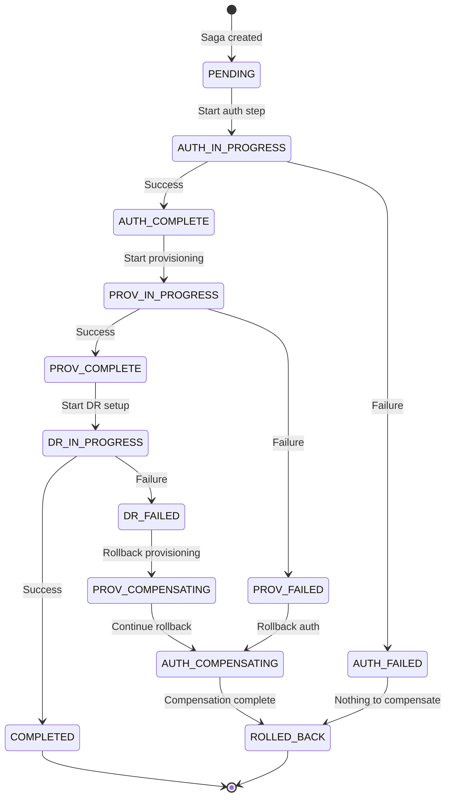

# Multi-Tenant Cloud Platform

## Overview

Backend automation platform enabling enterprise customers to provision cloud infrastructure, SSO/MFA, and disaster recovery through a unified system.

**Key outcomes:**
- Reduced customer onboarding from hours of manual work to seconds
- Maintained high-availability SLA across all integrations
- Zero data loss during external service outages

---

## My Role

Solo backend engineer responsible for:
- End-to-end system architecture
- SSO/MFA integration (Keycloak, SAML, OIDC, LDAP)
- Automated provisioning pipelines
- CI/CD infrastructure
- v2 saga orchestration migration (in progress)

---

## System Architecture

### v1 — Synchronous Monolith (Current Production)

The initial system prioritized speed-to-market with a synchronous Go monolith.



**Characteristics:**
- Single Go binary on systemd
- Synchronous request handling
- Minimal dependencies (intentional)
- All orchestration in request handlers

**Tradeoffs:**

| Pros | Cons |
|------|------|
| Simple deployment | Timeout risks on long operations |
| Easy debugging | No retry isolation |
| Fast iteration | Tight coupling to external services |

---

### v2 — Saga Pattern with PostgreSQL (In Development)

Adding saga orchestration to the monolith for resilience and auditability. Same deployment model, better failure handling.



**Why stay monolith?**
- Small team (solo engineer + 2 juniors onboarding)
- ~100 operations/day doesn't justify distributed complexity
- Saga pattern solves the actual problem: coordinating unreliable external services
- Can extract services later if scale demands it

---

## Saga: Customer Onboarding Flow



---

## Saga: Compensation (Rollback) Flow

When a step fails, the saga reverses previously completed steps in order.


---

## Saga State Machine



---

## PostgreSQL Saga Table Design

```sql
-- Saga instance tracking
CREATE TABLE sagas (
    id UUID PRIMARY KEY DEFAULT gen_random_uuid(),
    type VARCHAR(50) NOT NULL,           -- 'customer_onboarding', etc.
    state VARCHAR(50) NOT NULL,          -- Current state
    payload JSONB NOT NULL,              -- Input data
    context JSONB DEFAULT '{}',          -- Accumulated results
    created_at TIMESTAMPTZ DEFAULT NOW(),
    updated_at TIMESTAMPTZ DEFAULT NOW(),
    completed_at TIMESTAMPTZ,
    error TEXT
);

-- Saga step history (audit log)
CREATE TABLE saga_steps (
    id UUID PRIMARY KEY DEFAULT gen_random_uuid(),
    saga_id UUID REFERENCES sagas(id),
    step VARCHAR(50) NOT NULL,
    status VARCHAR(20) NOT NULL,         -- 'started', 'completed', 'failed', 'compensated'
    input JSONB,
    output JSONB,
    error TEXT,
    started_at TIMESTAMPTZ DEFAULT NOW(),
    completed_at TIMESTAMPTZ
);

CREATE INDEX idx_sagas_state ON sagas(state);
CREATE INDEX idx_saga_steps_saga_id ON saga_steps(saga_id);
```

---

## Why Saga Pattern?

| Requirement | Why Saga Solves It |
|-------------|-------------------|
| Long-running operations | Each step is independent, no HTTP timeout risk |
| Partial failure handling | Compensating transactions rollback cleanly |
| Auditability | Every state transition persisted in PostgreSQL |
| Resumability | Saga can resume after crash from last known state |
| Observability | Clear state machine makes debugging trivial |

---

## Why Roll Your Own Saga?

Evaluated several approaches for workflow orchestration:

| Option | Verdict |
|--------|---------|
| **Temporal** | Excellent, but heavy. Requires separate cluster, adds operational burden for ~100 ops/day |
| **NATS JetStream** | Overkill for current throughput |
| **RabbitMQ** | Same — adds infra without proportional benefit |
| **PostgreSQL + Go** | Right-sized. ACID transactions, simple queries, already in stack |

**Decision:** Hand-rolled saga orchestrator with PostgreSQL state. Polls for pending work or uses `pg_notify` for lightweight signaling. If we hit scale limits, Temporal is the upgrade path — but that's a good problem to have.

---

## Key Technical Decisions

See [decisions.md](./decisions.md) for detailed writeups on:
- Identity provider evaluation
- Monolith-first strategy
- LDAPS over LDAP
- Idempotency patterns
- Why Go

---

## Code Samples

See [code-samples.md](./code-samples.md) for anonymized production patterns:
- Graceful shutdown
- Retry with exponential backoff
- Functional options pattern
- Middleware (recovery, logging, auth)
- Error handling
- Webhook signature validation
- Input validation with generics
