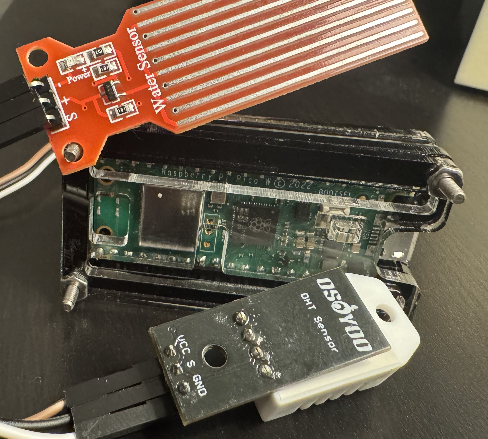
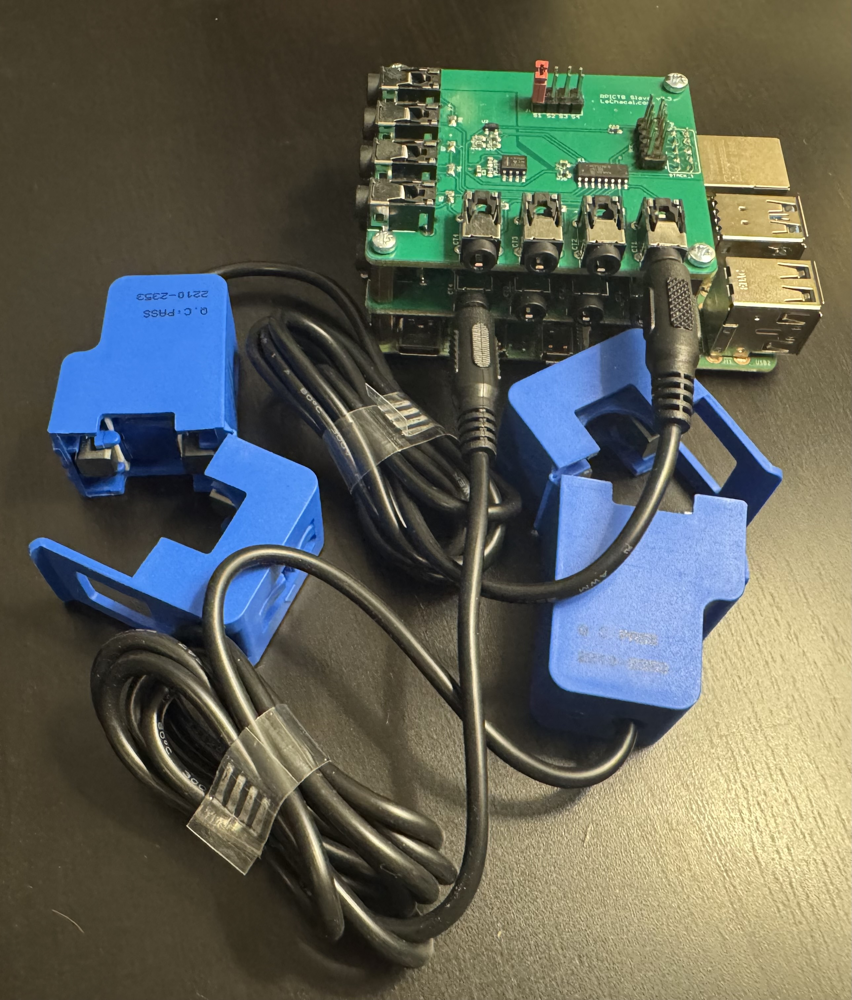

# Pico Environmental Sensor

## Overview

Low-cost IoT environmental monitoring system built with a Raspberry Pi Pico W. Running continuously for 3+ years with zero downtime, including through extreme temperature conditions.

**Repository:** [github.com/pwilliams-ck/pico-sensor](https://github.com/pwilliams-ck/pico-sensor)

---

## The Problem

Needed environmental monitoring in a location with:
- Extreme temperature swings
- No existing infrastructure
- Limited budget

Commercial solutions were expensive and overkill for the requirements.

---

## The Solution

Built a self-contained sensor unit using the cheapest reliable parts available.



**Hardware:**
- Raspberry Pi Pico W (~$6)
- Environmental sensor module
- Protective enclosure (hand-assembled)
- Total BOM: Under $20

**Software:**
- MicroPython
- Polling loop (every few seconds)
- WiFi auto-reconnect
- LED status indicator

---

## Implementation Details

### WiFi Status LED

Simple but useful for debugging in the field:

```python
# LED behavior
# Flashing = attempting to connect
# Solid    = connected and running
```

### Reliability Design

The code prioritizes uptime over features:

- **Polling loop** — Simple `while True` with sensor reads and sleep
- **Auto-reconnect** — WiFi drops happen; the device recovers automatically
- **No dependencies** — Pure MicroPython, no external libraries to break
- **Fail-safe defaults** — If a read fails, retry; don't crash

### Why Pi Pico W?

| Option | Verdict |
|--------|---------|
| ESP32 | Cheaper, but less documentation at the time |
| Arduino + WiFi shield | More expensive, more complexity |
| Raspberry Pi Zero | Overkill, higher power draw, needs SD card |
| **Pi Pico W** | Right-sized: $6, built-in WiFi, MicroPython support |

---

## Results

| Metric | Value |
|--------|-------|
| Uptime | 3+ years continuous |
| Hardware failures | 0 |
| Code changes since deploy | 0 |
| Total cost | <$20 |

The device has survived multiple seasons of extreme temperatures without intervention.

---

## Architecture for Scale (Not Implemented)

Original plan for multi-sensor deployment:

```
┌─────────┐     ┌─────────┐     ┌─────────┐
│ Pico 1  │     │ Pico 2  │     │ Pico N  │
└────┬────┘     └────┬────┘     └────┬────┘
     │               │               │
     └───────────────┼───────────────┘
                     │
                     ▼
              ┌─────────────┐
              │ Raspberry Pi│
              │ (Hub/Agg)   │
              └──────┬──────┘
                     │
                     ▼
              ┌─────────────┐
              │ Data Store  │
              └─────────────┘
```

For multiple Picos, a Raspberry Pi hub would aggregate data and handle network coordination. Single Pico connects directly to WiFi.

---

## Future Work (Unfinished)

Was designing a datacenter power monitoring system before role change:

**Concept:** Raspberry Pi units connected to end-of-row PDUs, providing real-time per-cabinet power data.



```
┌─────────────────────────────────────────────────┐
│              Datacenter Row                     │
│  ┌───┐ ┌───┐ ┌───┐ ┌───┐ ┌───┐ ┌───┐ ┌───┐    │
│  │Cab│ │Cab│ │Cab│ │Cab│ │Cab│ │Cab│ │Cab│    │
│  └─┬─┘ └─┬─┘ └─┬─┘ └─┬─┘ └─┬─┘ └─┬─┘ └─┬─┘    │
│    └─────┴─────┴─────┴─────┴─────┴─────┘       │
│                      │                          │
│                 ┌────┴────┐                     │
│                 │ End-Row │                     │
│                 │   PDU   │                     │
│                 └────┬────┘                     │
│                      │                          │
│                 ┌────┴────┐                     │
│                 │   Pi    │◄── Power data       │
│                 │ Monitor │    every second     │
│                 └─────────┘                     │
└─────────────────────────────────────────────────┘
```

Would require electrician coordination for PDU integration. Project shelved after promotion.

---

## Lessons Learned

1. **Boring technology wins** — MicroPython and a simple polling loop beat clever async patterns for reliability
2. **Cheap can be robust** — $6 microcontroller running 3+ years
3. **Ship small** — Single sensor worked, multi-sensor hub was never needed
4. **LED feedback matters** — Knowing connection state at a glance saves debugging time
